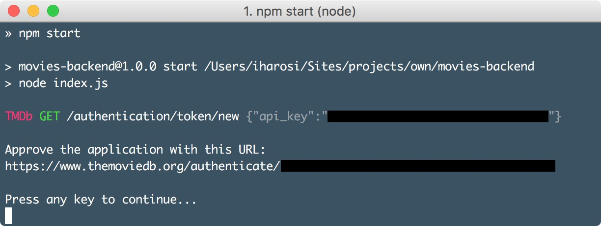

# Movies backend
Backend service which fetches metadata based on movies found in a folder and create a TMDb List of them.


## Install dependencies

Requirements: [Node.js](https://nodejs.org/), [TMDb account](https://www.themoviedb.org/account/signup), [TMDb API key](https://www.themoviedb.org/faq/api?language=en), [TMDb list](https://www.themoviedb.org/documentation/editing/lists)

1. `npm install`

## Create and set config file

1. `mv config.js.sample config.js`
2. use your favourite editor to edit the config file
3. enter your TMDb API key
4. enter your existing TMDb list id(s) and name(s) and pair with your media folder(s)

## Run

For Node.js version ≧ 6

1. `npm start`

For Node.js version ≦ 5

1. `npm run with-babel`

2. approve the application on TMDb with the given URL



## Run as a service

You can run Movies backend as a service on your Synology NAS device.  
To do that you have to SSH into your NAS.  
Then create an Upstart script at `/etc/init/movies-backend.conf` with this content:

```
description "Movies backend"

start on runlevel [2345]
stop on runlevel [016]
respawn

setuid admin
chdir /volume1/homes/admin/movies-backend/
exec npm run with-babel
```

Download the latest release and extract it in your home then change the path regarding where you placed the source code.
You should replace the username (admin) if your user is named something else.  

Now start the service:

```
sudo start movies-backend
```

That's it.

## About the folder name recognition

Folder name should start with the movie title followed by the release year.  
Release year can be followed by any other characters but it won't be recognised.  
The title of the film can be in any language but original movie titles preferred for better matching.  
If a title includes special characters it can be omitted.  

Possible folder names for `2001: A Space Odyssey (1968)`:

* 2001 (1968)
* 2001 A Space Odyssey (1968)
* 2001 Űrodüsszeia (1968)
* 2001.1968
* 2001.A.Space.Odyssey.1968
* 2001.Urodusszeia.1968
